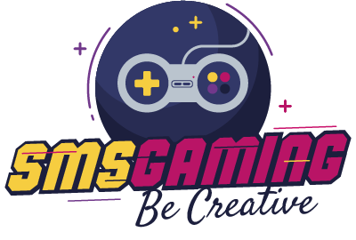
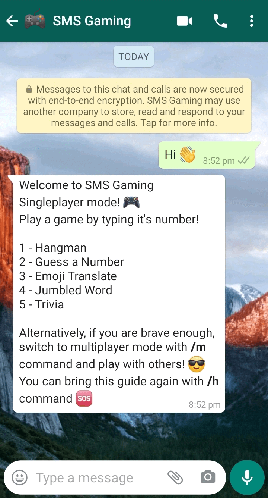
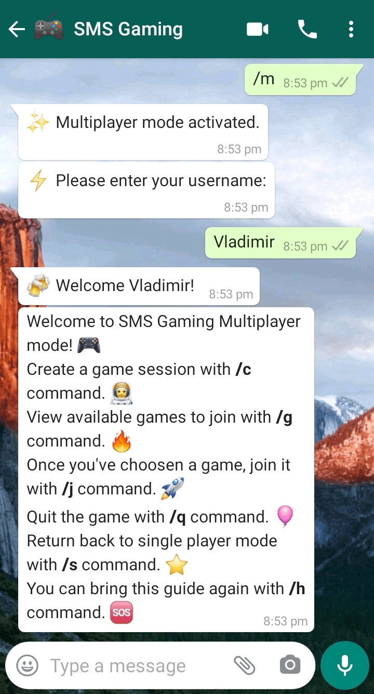
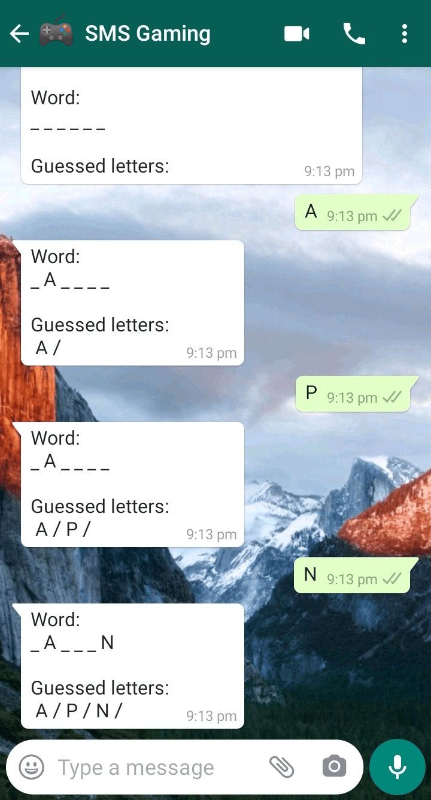
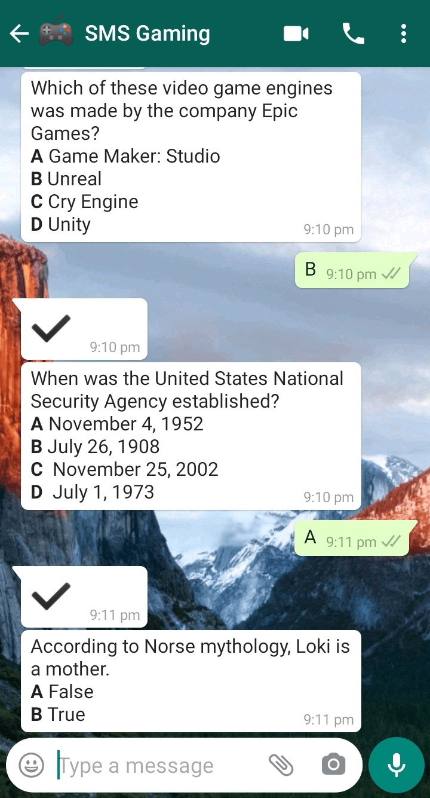

<div align="center">
  
</div>

<div align="center">
  
  
  
  
</div>

<h4 align="center">
  🎮 Gaming platform powered by Twilio SMS.
</h4>

## :package: Installation (development)

```shell
# Clone the project
git clone https://github.com/VladimirMikulic/sms-gaming.git
# Enter the project's folder
cd sms-gaming
# Install dependecies
npm i
# Start the development server
npm start
```

After you've started the development server, follow [this guide](https://www.twilio.com/blog/track-whatsapp-message-status-node-js-twilio-api-for-whatsapp) which will explain to you how to send WhatsApp messages from your phone to your Twilio number.

In the development, place your environment variables in `.env` file. The file is automatically loaded when server starts. (Required environment variables are mentioned below)

## :cloud: Deployment

To deploy the server to production, you'll need a cloud hosting provider. Some of the popular ones are [Heroku](https://www.heroku.com/), [Digital Ocean](https://www.digitalocean.com/) and [AWS](https://aws.amazon.com/).

The server needs these environment variables to run:

- TWILIO_ACCOUNT_SID
- TWILIO_AUTH_TOKEN
- SESSION_SECRET

## :camera_flash: Screenshots

- Play alone or join others, your choice!

<div>
  
  
</div>

<br><br><br><br><br><br><br><br><br><br><br><br>
<br><br><br><br><br><br><br><br><br><br><br><br><br>

- Games that you'll enjoy! (Left: Hangman, Right: Trivia)
<div>
  
  
</div>

<br><br><br><br><br><br><br><br><br><br><br><br>
<br><br><br><br><br><br><br><br><br><br><br><br><br>

## :man: Author

**Vladimir Mikulic**

- Twitter: [@VladoDev](https://twitter.com/VladoDev)
- Github: [@VladimirMikulic](https://github.com/VladimirMikulic)
- LinkedIn: [@vladimirmikulic](https://www.linkedin.com/in/vladimir-mikulic/)

## :handshake: Contributing

Contributions, issues and feature requests are welcome!

## 🍻 Credits

Logo design is provided by [Freepik](http://www.freepik.com). ❤️

## :pencil: License

This project is licensed under [MIT](https://opensource.org/licenses/MIT) license.

## :man_astronaut: Show your support

Give a ⭐️ if you like this project!
